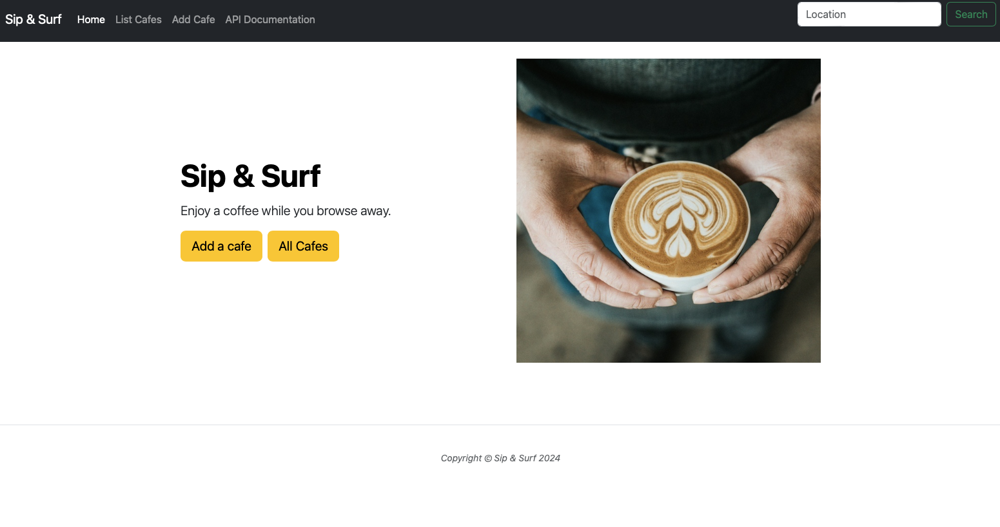

# Sip & Surf

Sip & Surf is a Flask application built with Python that helps you discover and explore cafes. Utilizing Jinja for templating and SQLAlchemy for database interactions, it features a user-friendly interface where you can search for cafes by location, add new cafes, and view detailed information about each cafe. Additionally, the application provides API endpoints for further integration, and you can modify database entries directly through the website.

I developed this application as a part of the Udemy course [100 Days of Code: The Complete Python Pro Bootcamp](http://www.udemy.com/course/100-days-of-code/). I thank Angela Yu and her team for this excellent course and I would highly recommend it to anyone interested in learning and enhancing their coding skills in Python. Photos are taken from the [Unsplash website](https://unsplash.com).




## Table of Contents

- [Features](#features)
- [Folder Structure](#folder-structure)
- [Database Schema](#database-schema)
- [Installation](#installation)
- [Usage](#usage)
- [API Documentation](#api-documentation)
- [Contributing](#contributing)
- [License](#license)

## Features

- **Search Bar**: Quickly find cafes by entering a location.
- **Cafes List**: View a comprehensive list of all cafes.
- **Add Cafe**: Easily add new cafes to the database.
- **API Documentation**: Access detailed API documentation with links to Postman for testing.

## Folder Structure

- templates/: Contains HTML templates
- static/: Contains images and static files
- instance/: Contains the database
- Sip & Surf.postman_collection: Postman documentation (JSON)

## Database Schema

The database consists of a list of cafes with the following fields:

- **Cafe Name**: Enter the name of the cafe.
- **Maps Link**: Enter the URL of the location of the cafe.
- **Image Link**: Enter the URL of an image of the cafe.
- **Location**: Enter the location of the cafe.
- **Number of Seats**: Enter the number of seats available.
- **Toilets**: Availability (Yes/No).
- **Wifi**: Availability (Yes/No).
- **Power**: Select from [✘, 🔌, 🔌🔌, 🔌🔌🔌, 🔌🔌🔌🔌, 🔌🔌🔌🔌🔌].
- **Take Calls**: Availability (Yes/No).
- **Coffee Price (£)**: Enter the price of a coffee in pounds.

## Installation

To set up the project locally, follow these steps.

1. Clone the repository.
    ```
   git clone https://github.com/yourusername/sip-and-surf.git](https://github.com/Anirudh-Kulkarni/Sip-Surf)
   cd sip-and-surf
2. Install the required packages.
   ```
   pip install -r requirements.txt
3. Run the `main.py` file.

## Usage

Once the application is running, navigate to http://127.0.0.1:5000 in your web browser. You can:

- Search for cafes by entering a location in the search bar.
- View the list of all cafes.
- Add a new cafe using the provided form.
- Access the API documentation for more information on available endpoints.

## API Documentation

The API allows you to interact with the cafe data programmatically. Here are the available endpoints:

### API Endpoints

| Method | Endpoint                     | Description                                                                                         |
|--------|------------------------------|-----------------------------------------------------------------------------------------------------|
| GET    | `/api/search`                | Search cafes by location. Use the location parameter to pass a location name.                      |
| GET    | `/api/all`                   | Get all cafes. Returns a JSON with the data from all cafes in the database.                       |
| POST   | `/api/add`                   | Add a new cafe. Enter all the required parameters in the body field.                               |
| PATCH  | `/api/update_price/`         | Update the price of a black coffee at a particular cafe. Requires `id` and `new_price` parameters.|
| DELETE | `/api/report-closed`         | Delete a cafe by ID. Provide the cafe ID in the route and a valid API key for this operation.     |


For more detailed API documentation, refer to [Postman Documentation](https://documenter.getpostman.com/view/38746038/2sAXxS7AvK).

## Contributing

Contributions are welcome! If you'd like to contribute to the project, follow these steps:

1. Fork the repository.
2. Create a new branch (git checkout -b feature/YourFeature).
3. Make your changes and commit them (git commit -m 'Add some feature').
4. Push to the branch (git push origin feature/YourFeature).
5. Create a new Pull Request.

## License

This project is licensed under the MIT License. See the LICENSE file for more information.
